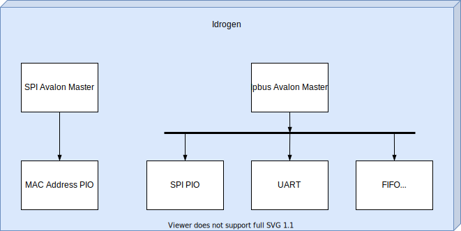

# Summary of QSYS IP addresses

## PCIe

| **Register**      |  **Base** |  **End**  |
|-------------------|:---------:|:---------:|
| PCIe rd_dts_slave | 8000_0000 | 8000_1FFF |
| PCIe wr_dts_slave | 8000_2000 | 8000_3FFF |
| SysId             |      A000 |      A007 |
| Pio               |      8000 |      800F |
| UART              |      2000 |      201F |

## Ipbus 1G

### Registers map

| **Register**         | **Base** | **End** |
|----------------------|:--------:|:-------:|
| UART                 |     0020 |    003F |
| SysId                |     0040 |    0047 |
| Pio for SPI          |     0080 |    008F |
| FIFO UART in         |     0100 |    0103 |
| FIFO UART in status  |     0140 |    015F |
| FIFO UART out        |     0200 |    0203 |
| FIFO UART out status |     0240 |    025F |
| Pio for MAC Address  |     1080 |    108F |

### Diagramm

    

