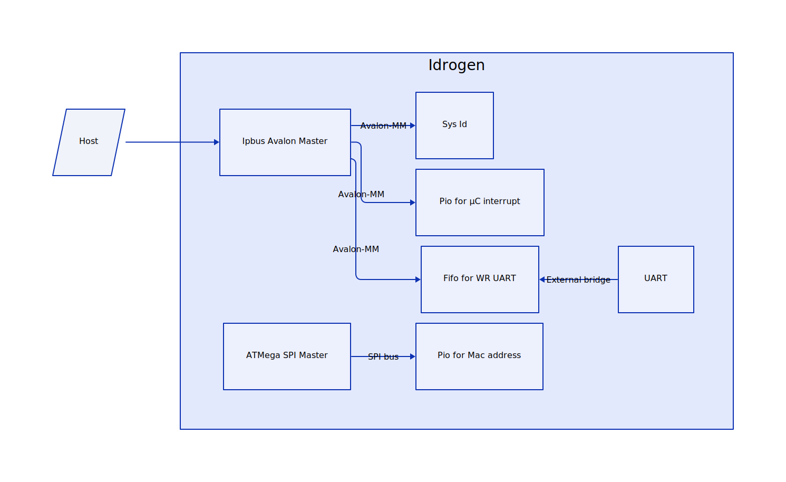

# Summary of QSYS IP addresses

## PCIe

### Registers map

| **Register**      |  **Base** |  **End**  |
|-------------------|:---------:|:---------:|
| On-chip memory    |         0 |    1_FFFF |
| PCIe wr_dts_slave |    2_0000 |    2_1FFF |
| PCIe rd_dts_slave |    2_2000 |    2_3FFF |
| UART              |    2_0000 |    2_001F |
| Pio               |    2_0020 |    2_002F |
| SysId             |    2_4000 |    2_4007 |

### Diagramm

    

## Ipbus 1G

UART monitor ([wr_monitor.v](wr_monitor.md))

### Registers map

| **Register**         | **Base** | **End** |
|----------------------|:--------:|:-------:|
| UART                 |     0020 |    003F |
| SysId                |     0040 |    0047 |
| Pio for SPI          |     0080 |    008F |
| FIFO UART in         |     0100 |    0103 |
| FIFO UART in status  |     0140 |    015F |
| FIFO UART out        |     0200 |    0203 |
| FIFO UART out status |     0240 |    025F |
| Pio for MAC Address  |     1080 |    108F |

### Diagramm

    

## Jtag to UART

UART monitor ([wr_monitor.v](wr_monitor.md))
### Registers map

| **Register**         | **Base** | **End** |
|----------------------|:--------:|:-------:|
| UART                 |     0020 |    003F |
| SysId                |     A000 |    A007 |
| FIFO UART in         |     0100 |    0103 |
| FIFO UART in status  |     0140 |    015F |
| FIFO UART out        |     0200 |    0203 |
| FIFO UART out status |     0240 |    025F |

### Diagramm

    

