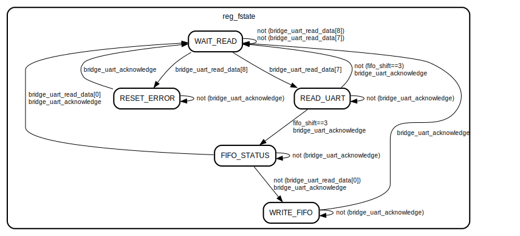

# Module : wr_monitor

- **Fichier**: wr_monitor.v

## Diagramme

    

## Ports

| Port name               | Direction | Type        | Description                                                   |
| ----------------------- | --------- | ----------- | -------------------------------------                         |
| clock                   | input     | wire        | Signal d'horloge                                              |
| nreset                  | input     | wire        | Signal de reset (actif à l'état bas)                          |
| bridge_uart_acknowledge | input     | wire        | Interface Avalon : Validation de la lecture ou de l'écriture  |
| bridge_uart_read_data   | input     | wire [31:0] | Interface Avalon : Donnée lue                                 |
| bridge_uart_read        | output    | reg         | Interface Avalon : Demande de lecture                         |
| bridge_uart_write       | output    | reg         | Interface Avalon : Demande d'écriture                         |
| bridge_uart_byte_enable | output    | reg   [3:0] | Interface Avalon : Indique les octets à lire/écrire           |
| bridge_uart_address     | output    | reg   [8:0] | Interface Avalon : Adresse de lecture/écriture                |
| bridge_uart_write_data  | output    | reg  [31:0] | Interface Avalon : Donnée à écrire                            |

## Signaux

| Nom             | Type                | Description                                                                                                           |
| --------------- | ------------------- | -----------                                                                                                           |
| fifo_shift      | reg [1:0]           | Compteur d'octets reçus : quand 4 octets sont reçus, ils sont stockés dans un mot de 32-bits et écrit dans la FIFO |
| reg_fstate      | reg [3:0]           | Registre d'état de la FSM                                                                                             |

## Constantes

| Nom                 | Value  | Description                                                                                                        |
| ------------------- | ------ | -------------------------------------------------------                                                            |
| FIFO_WR_REG         | 0x100  | Adresse d'écriture dans la FIFO                                                                                    |
| FIFO_STATUS_REG     | 0x144  | Adresse du registre de status d'entrée de la FIFO                                                                  |
| UART_ADDRESS_READ   | 0x020  | Adresse de lecture des données de l'UART                                                                           |
| UART_ADDRESS_STATUS | 0x028  | Adresse du registre de status de l'UART                                                                            |
| WAIT_READ           | 0      | État d'attente d'un octet en provenance de l'UART                                                                  |
| READ_UART           | 1      | Lecture de la donnée de l'UART                                                                                     |
| DECISION            | 2      | Décide si l'on attend un nouveau caractère ou si l'on écrit dans la FIFO                                           |
| FIFO_STATUS         | 4      | Vérification du status de la FIFO : si celle-ci est pleine, on abandonne le mot, soit les quatres derniers octets  |
| WRITE_FIFO          | 8      | Écriture dans la FIFO                                                                                              |
| RESET_ERROR         | 16     | Reset de l'UART s'il y a une erreur (exemple : overflow)                                                           |

## Processus

- state_machine: ( @(posedge clock or negedge nreset) )
  - **Type:** always

## State machines

    

